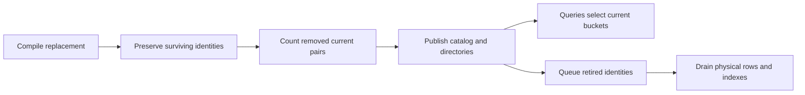

# Policy edits, object archive and cleanup

A policy edit changes the definition at one finalized revision. Existing resource
names and the actor resource name remain fixed. Surviving relation names keep
their grants, including when an expression, type restriction or manager changes.
Removing a relation also removes grants that refer to it as a userset. Recreating
the name does not restore those grants.

## Stored identities

`PolicyRecord.relations` maps compiled resource/relation names to immutable numeric
identities and retains the next unused identity. Positive identities are allocated
monotonically. Every object resource's implicit `owner` relation uses zero because
resources and their ownership relation cannot be removed. Actor roles use positive
identities.

`RelationshipRecord.generations` binds two identities:

- `target`: the relationship's own relation.
- `subject`: the referenced relation for a nonempty userset subject. Actors,
  wildcards, object references without a relation, and references to a permanent
  owner relation use zero.

The two relation identities and mandatory `RelationshipRecord.incarnation` bind
each physical grant to its target object state:

```
relationship/v5/{policy}/{target:016x}/{subject:016x}/v3/{resource}/{object}/{incarnation:016x}/{relation}/{subject_hash}
```

The resource, object and relation components retain their hex encoding. Owners
always use incarnation zero; non-owner grants use the current
[object-state point](native-relationship-keys.md). Absence means initial zero, not
registration. This is a fresh-state format. Older relationship namespaces are
rejected during restoration; there is no implicit migration or fallback.

## Editing and cleanup

Every retained relationship contributes to mirrored physical outgoing/incoming
counts for its `(target, subject)` pair and an object-incarnation pair count:
`relation_state/{policy}/object/v3/{resource}/{object}/{incarnation:016x}/{target:016x}/{subject:016x}`.
Resource/object components are hex-encoded; nonzero counts are eight-byte
big-endian values. Physical counts include archived and obsolete records.
Metadata rewrites do not increment counts.

Separate logical pair counts include rows selected by current relation identities
and target-object incarnation. Archived stable owners remain counted. Relation
edits clear retired logical counts; archive subtracts outgoing current grant
counts. Physical counts remain until cleanup; their zero entries are omitted. A
current pair with retained physical rows keeps a canonical logical zero when no current
grants remain. Missing that logical key is corruption. The logical key disappears
on relation retirement or when the physical count reaches zero. A separate
authenticated directory lists active subject identities with physical records
under each current target identity.

`AcpModule::edit_policy` compiles the replacement and retains identities for names
that survive. It sums logical pair counts when either endpoint is removed,
counting a pair once even when both endpoints disappear. Already retired identities are excluded,
so an edit does not count a previously invalidated or archived-away grant again.
It then publishes the replacement catalog, updates current directories, and queues physical cleanup.
No relationship-row scan is needed to calculate the returned removal count.

Work depends on the policy definition and its current relation pairs. It is not
constant time. The raw policy definition remains limited to 64 KiB.



Retired-generation cleanup first drains outgoing rows, then uses the incoming
pair index to locate remaining references. It does not scan unrelated objects.
Generation, object-incarnation and whole-policy cleanup share one per-revision
budget: 128 cleanup items, 4 MiB of accounted reads/writes, 640 writes, and eight visits of at most
16 items each. The class served first rotates across the three classes with
revision height. Persistent queues preserve progress across restart.

`RecordStore::apply_records` commits a prepared mutation atomically. Read-only
stores reject it by default; the in-memory module store applies its infallible
writes together. Module commands and end-of-revision maintenance publish their
candidate snapshot only after success.

## Object archival

Archive checks management authority, the stable owner and the selected indexes.
It visits current relation pairs for the object's resource and reads that object's
current-incarnation counters. The returned count is one for the owner plus all
current outgoing non-owner grants, including archived rows within those current
pairs. Incoming userset references stored on other target objects remain unchanged.

One prepared atomic change marks the owner archived, subtracts outgoing logical
counts, advances the object incarnation and queues cleanup of the old incarnation.
No grant-row enumeration is needed. Even an incarnation with no grants is queued;
a repeated archive returns zero without advancing state. Budget exhaustion,
malformed accessed metadata or counter overflow leaves state unchanged.

Unarchive reactivates the same owner and never restores old grants. New grants use
the advanced incarnation and survive cleanup of earlier ones. Transfers and
commitment amendments preserve incarnation and current grants. Incarnation state
is independent of registration, so role objects and generic store adapters can
hold grants without an owner record.

Archive work depends on the policy definition and current relation pairs, not the
number of retained grants or earlier incarnations. It uses the command allowance;
this is deterministic accounted work, not a constant-time or latency claim.

## Reads and recovery

The shared permission evaluator proves the current policy catalog, subject
directory and target-object incarnation points at the same root as the selected
relationship buckets. Retired target or userset identities are excluded before relationship enumeration, so their rows
do not consume the current permission query's record budget. Exact-object queries
select current incarnations, with owners at zero. Broader relationship pages may inspect obsolete incarnations and filter them while
preserving their physical continuation. Query planning permits at most 256 directory reads, 256 generated buckets and 1 MiB of directory/prefix
bytes, checked before allocation. Row inspection has a separate limit of
128 records and 1 MiB. Exact resource/relation selection narrows planning to its
current target identity. Oversized planning fails even if no object rows match.

Low-level raw prefix proofs describe physical storage. Typed policy prefix
verification requires object-state witnesses and rejects inactive generations or
incarnations; typed pages filter them while preserving the physical continuation.
A broad physical prefix page can therefore be empty and still have a continuation. Its cumulative scan cost can include retired rows until
cleanup; it is not the module's current-bucket pagination interface.

Restoration checks generation/name bindings, nonreuse bounds, mirrored physical
counts, logical counts, exact object-incarnation pair counts, current object points,
active-directory completeness, and durable cleanup descriptors and queues. Missing
or orphan object counters are rejected; restoration does not rebuild this authenticated index from older snapshots.
Policy deletion retains object points until relationship rows, descriptors and
queues have been removed. It then removes those points in a separate cleanup phase.

Edits and archive validate the metadata and indexes they touch. Their exact counts
rely on indexed writes and complete restoration; they do not reread every physical
primary to detect corruption. Malformed unread obsolete rows can therefore fail
later restoration or cleanup rather than the archive request. Reads, cleanup and
restoration reject malformed records they inspect.

These are ACP v1 replacement semantics. They do not reconcile competing offline
policy branches or implement the separate causal ACP v2 design.
