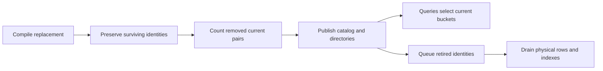

# Policy edits and relation generations

A policy edit changes the definition at one finalized revision. Existing resource
names and the actor resource name remain fixed. Surviving relation names keep
their grants, including when an expression, type restriction or manager changes.
Removing a relation also removes grants that refer to it as a userset. Recreating
the name does not restore those grants.

## Stored identities

`PolicyRecord.relations` maps compiled resource/relation names to immutable numeric
identities and retains the next unused identity. Positive identities are allocated
monotonically. Every object resource's implicit `owner` relation uses zero because
resources and their ownership relation cannot be removed. Actor roles use positive
identities.

`RelationshipRecord.generations` binds two identities:

- `target`: the relationship's own relation.
- `subject`: the referenced relation for a nonempty userset subject. Actors,
  wildcards, object references without a relation, and references to a permanent
  owner relation use zero.

Both identities precede the original encoded resource/object/relation/subject key:

```
relationship/v4/{policy}/{target:016x}/{subject:016x}/v2/{resource}/{object}/{relation}/{subject_hash}
```

The resource, object and relation components retain their existing hex encoding.
This is a fresh-state format. Older relationship namespaces are rejected during
restoration; there is no implicit migration or fallback.

## Editing and cleanup

Each physical relationship contributes to mirrored outgoing and incoming counts
for its `(target, subject)` pair. Archived records still count. Metadata rewrites
do not increment counts. A separate authenticated directory lists current subject
identities with records under each target identity.

`AcpModule::edit_policy` compiles the replacement and retains identities for names
that survive. It sums pair counts when either endpoint is removed, counting a pair
once even when both endpoints disappear. Already retired identities are excluded,
so an edit does not count a previously invalidated grant again. It then publishes
the replacement catalog, updates current directories, and queues physical cleanup.
No relationship-row scan is needed to calculate the returned removal count.

Work depends on the policy definition and its current relation pairs. It is not
constant time. The raw policy definition remains limited to 64 KiB.



Retired-generation cleanup first drains outgoing rows, then uses the incoming
pair index to locate remaining references. It does not scan unrelated objects.
Generation and whole-policy cleanup share one per-revision budget: 128 primary
items, 4 MiB of accounted reads/writes, 640 writes, and eight visits of at most
16 items each. The class served first alternates with revision parity. Persistent
queues preserve progress and fairness across restart.

`RecordStore::apply_records` commits a prepared mutation atomically. Read-only
stores reject it by default; the in-memory module store applies its infallible
writes together. Module commands and end-of-revision maintenance publish their
candidate snapshot only after success.

## Reads and recovery

The shared permission evaluator proves the current policy catalog and subject
directory at the same root as the selected relationship buckets. Retired target
or userset identities are excluded before relationship enumeration, so their rows
do not consume the current permission query's record budget. Module relationship
filtering and pagination also select current buckets. Query planning permits at
most 256 directory reads, 256 generated buckets and 1 MiB of directory/prefix
bytes, checked before allocation. Row inspection has a separate limit of
128 records and 1 MiB. Exact resource/relation selection narrows planning to its
current target identity. Oversized planning fails even if no object rows match.

Low-level raw prefix proofs describe physical storage. Typed policy prefix
verification rejects inactive rows; typed pages filter them while preserving the
physical continuation. A broad physical prefix page can therefore be empty and
still have a continuation. Its cumulative scan cost can include retired rows until
cleanup; it is not the module's current-bucket pagination interface.

Restoration checks generation/name bindings, nonreuse bounds, mirrored physical
counts, active-directory completeness, and durable cleanup descriptors and queues.
An edit validates the metadata and indexes it touches; it no longer decodes every
primary relationship solely to detect unrelated corruption. Reads, cleanup and
restoration reject malformed records they inspect.

These are ACP v1 replacement semantics. They do not reconcile competing offline
policy branches or implement the separate causal ACP v2 design.
