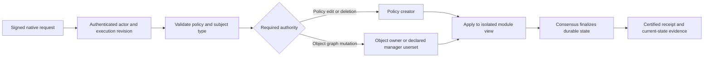

# ACP v1 in Vera

Vera executes ACP in Rust. Policy compilation lives in `crates/acp`, graph
evaluation in `crates/zanzibar`, and authenticated lifecycle operations in
`crates/vera-modules/src/acp`. The native client and optional EVM interface dispatch
to the same module implementation. The Go engine is used only to generate test
fixtures; it is not part of the node or its runtime dependencies.

## Engine surface

The reference is Go `acp_core` v0.8.2, used by Go Vera at
`205df1adcd27a350168b14fe49b9160387acba93`.

| Go engine operation | Rust module entry point |
| --- | --- |
| CreatePolicy / CreatePolicyWithSpecification | `execute_create_policy(PolicyCreation)`; YAML and JSON definitions |
| EditPolicy | `edit_policy_at`; keeps the policy ID, specification and existing resources |
| EditPolicyMetadata | `edit_policy_metadata`; replaces supplied attributes/blob |
| GetPolicy / ListPolicies | `query_policy`, `query_policies`, `query_policies_page` |
| ValidatePolicy | `query_validate_policy`, `validate_policy_definition` |
| DeletePolicy | `delete_policy`; creator-authorized logical deletion and bounded record cleanup |
| SetRelationship / DeleteRelationship | `execute_policy_cmd`; typed actor, wildcard, object and userset subjects |
| FilterRelationships | `query_filter_relationships`, `query_relationships_page` with structured selectors |
| RegisterObject / ArchiveObject / UnarchiveObject | `execute_policy_cmd` |
| TransferObject | `transfer_object` or `PolicyCmd::TransferObject` |
| GetObjectRegistration | `query_object_registration`; includes archived ownership |
| VerifyAccessRequest | `query_verify_access_request`; union, intersection, exclusion and traversal |
| CheckManagementAuthority | `check_management_authority`; evaluates owner and declared manager relations |
| GetPolicyCatalogue | `query_policy_catalogue`; declared names, known live objects and actors |
| EvaluateTheorem | `evaluate_theorem`; authorization and delegation assertions |
| AmendRegistration / RevealRegistration | authenticated commitment/reveal workflow; callers cannot choose a privileged principal or arbitrary earlier timestamp |
| SetParams / GetParams | Go core parameters are empty. Vera's operational parameters use the existing operator-authorized configuration |
| GetRuntimeManager | host plumbing, replaced by execution context and the module store |

Native calls are declared in `acp/abi.rs`. `VeraClient` exposes typed methods in
`native_tx/acp_lifecycle.rs` and `query/acp_lifecycle.rs`. `executePolicyCommand`
accepts a `PolicyCommandRequest` containing the command and optional supplied
metadata. Supplied metadata is supported when registering an object, creating a
grant, or revealing a registration. A repeated grant returns its original metadata.

## Authority and ordering

Creating a policy does not grant management rights over objects registered by
other actors. Managers can be recursive usersets, so revoking their group membership
revokes management authority. Ownership cannot be added or deleted with ordinary
relationship commands. Transfer changes the owner while preserving registration
priority and other grants. Archive removes grants and retains the archived owner;
unarchive restores ownership without restoring deleted grants.

Definition edits prune both removed relations and grants whose usersets refer to
removed relations. Recreating a relation cannot resurrect those deleted edges.
Policy deletion atomically removes the active policy and its authorization
visibility. Physical records are reclaimed as described below. Historical access
decisions and finalized receipts remain audit records.

Native policy creation records the actual actor, signer, submission and execution
revision. Definition/metadata edits record their last-modified revision. Optional
supplied metadata fields preserve the existing JSON encoding when empty. The
Borsh encoding of commitment and amendment metadata is unchanged.

These authorization and pruning changes affect execution results. Validators in
one consensus group must use a compatible release; this is not a rolling upgrade
between different execution rules.

## Deliberate differences and boundaries

This is a feature port, not a claim of identical transport or parser behavior:

- Existing Rust policies may explicitly declare/reference `owner`, omit subject
  `types` to allow unrestricted subjects, and define actor roles managed by the
  policy creator. Go rejects explicit owner syntax and grants to relations with
  no allowed subject types. **Declare `types` explicitly when moving policies from
  Go**; omitting them does not have the same authorization meaning.
- Unknown specification names are rejected. They do not silently become policies
  with no specification. Omitted specification on edit retains the selected one.
- Go's reachability-theorem evaluator returns success without evaluating the
  assertion. Rust rejects nonempty `ImpliedRelations` blocks. Authorization and
  delegation assertions are evaluated, with source byte ranges and individual
  accepted/rejected/error results.
- Read convenience methods report the endpoint's state and carry no finality
  proof. Use the existing certified permission/record/prefix APIs when independent
  verification is required. A theorem report is not a permission grant.
- Definitions and supplied metadata are limited to 64 KiB; theorem sources to
  64 KiB and 64 assertions. Pages inspect at most 128 records / 1 MiB, including
  records rejected by a filter. An empty page can have a continuation cursor.
  Cursors are exclusive storage positions, not revision certificates; repeated
  live RPC calls can observe different revisions. Unpaged queries reject oversized
  results rather than silently truncate. Policy ID listings require at most
  128 records / 1 MiB of stored key/value bytes, checked before decoding any policies;
  larger listings require certified policy pages. Policy reads, ID/full-record
  listings, pages, relationship filters and catalogues share `QueryBudget` work
  accounting. Runtime dispatch charges 1,000 base units plus 100 per inspected
  policy, directory or relationship record and one per 16 encoded key/value bytes,
  rounded up per record. A planned prefix or cursor seek costs 100 plus one per
  16 bytes, including empty scans. Policy-ID count-limit lookahead charges only its
  key; page lookahead charges its key and value before testing the page boundary.
  Relationship suffixes are materialized only after a prefix reserves its work.
  Read charges precede cloning and decoding; ordinary errors retain consumed
  units, and nested batches share the remaining execution allowance. These charges
  preserve existing hard query limits and cursor behavior; insufficient execution
  allowance returns an error rather than partial results. Public module convenience
  methods use unlimited execution allowance, while still enforcing hard query limits.
  This is deterministic work accounting, not an elapsed-time guarantee or a change
  to certified-proof read limits. For larger relationship
  catalogues, enumerate relationship pages and combine them with the policy's
  declared resources.
- [Definition edits](acp-policy-edits.md) retire indexed generation pairs atomically;
  physical cleanup runs later under the shared cleanup budget. Runtime edits meter
  reads, writes and preparation work without visiting every physical relationship.
  This accounting does not meter individual compiler instructions. The lifecycle
  component workload measures edit cost and full deletion teardown, including cleanup.

The commitment policy index is persisted in authenticated state, including for
expired commitments. It changes execution roots when commitments are written.
All validators must use the same indexing rules. Fresh deployments create the
index with each commitment. Native restoration rejects retained commitments
without it.
There is no index backfill or fallback scan. Commitment record encodings and
individual record proofs are unchanged.

ACP v1 edits use finalized execution order. They do not implement offline policy
branch merging, causal policy pins, or the separate ACP v2 design.

## Policy deletion and cleanup

`delete_policy` checks the policy creator, removes the active policy record and
compiled policy, and enqueues cleanup in one atomic operation. Repeating deletion
returns `false` without adding another job. Ownership, relationships, commitments,
amendments and policy commands stop being available through policy-aware APIs at
that execution revision. Recreating the same definition allocates a new policy ID;
it cannot recover grants from the deleted policy.

Cleanup runs deterministically after each block. A persistent FIFO queue gives a
policy up to 16 records per visit, with at most eight visits per tick. Across those
visits, cleanup reserves at most 128 logical records, 4 MiB of inspected and
written bytes, and 640 writes. Metadata work counts against these budgets.
Unserved jobs keep their turn when the budget runs out, and a maximum-size valid
native record can make progress with a fresh budget. Cleanup follows the policy's
relationship, commitment and amendment indexes; it does not scan unrelated
policies.

Commitments are removed with their policy, root and expiry indexes. Expiry of a
retired commitment cannot recreate those indexes. The retirement marker and queue
entry disappear when cleanup finishes. Recovery validates their counters,
references and completed phases. Corruption aborts the maintenance tick without
publishing partial cleanup, expiry or operation-pruning changes. Cleanup budgets
are separate from existing expiry and operation-pruning limits and from request
execution units. The number of ticks required grows with retained data and queued
policies.

Physical records can remain after logical deletion. Certified ownership and
relationship clients must verify the policy's presence at the same revision as
those records, using the [policy proof APIs](permission-proofs.md#native-prefix-and-owner-reads).
Generic record and prefix evidence authenticates physical storage only.
Relationships use the fresh-state `relationship/v4/` namespace; restore rejects
older namespaces rather than migrating them. Validators and consumers must use
matching [key and proof formats](native-relationship-keys.md). Receipt and finality
formats are unchanged.

## Policy edit work accounting

Direct and bearer definition edits consume 5,000 base execution units plus the
work tracked by `PolicyEditBudget`. The caller owns this allowance separately
from module snapshots, so reverting an edit or an enclosing batch cannot refund
completed work. Nested calls receive the remaining batch allowance. Ordinary
reverted edits retain their base and consumed units; exhausting the allowance
fails before publishing prepared records or replacing the compiled policy.
Native failed submissions still consume their full transaction allowance.

Accounting uses encoded bytes, rounded up in groups of 16:

| Work | Units |
| --- | --- |
| Point read | 100 + one per byte group, including the key |
| Prepared write or deletion | 200 + two per byte group, including the key |
| Definition parsing input | Eight per byte group |
| Visited relation pair | 32 |

Reads reserve their allowance before copying or decoding records. JSON encoding
reserves each output byte group before extending its buffer. Only after the
complete plan and updated policy fit does the module apply writes. Mirrored
counters give the exact invalidated row count without charging once per physical
relationship. The timestamped edit path reads and encodes its policy once.

Bearer edits also charge definition bytes before hashing the signed operation.
Stored outcome reads and writes use the same allowance. An authenticated retry
can recover its metered outcome after policy retirement without reading or
recompiling the current policy. Public module convenience methods retain an
unlimited allowance; runtime dispatch uses the explicit budgeted methods.

Before owned ABI decoding, both edit selectors enforce the existing 64 KiB
policy-definition bound; bearer edits also enforce the token's 16 KiB bound.
Definition-byte accounting is not instruction-level compiler metering. Existing
YAML expansion and policy-validation limits remain independent safeguards.
Archive and other module operations have separate resource behavior.

## Policy creation work

`createPolicy`, `createPolicyWithOptions`, and `bearerCreatePolicy` charge their
5,000-unit dispatch base plus a caller-owned creation allowance. Each reserves
leaf calldata processing at eight units per 16 bytes before owned ABI or JSON
decoding. The module separately reserves definition processing before compilation,
borrowed metadata fields before validation/cloning, and policy-counter and
live/retired-identifier reads before decoding. Record reads and prepared writes
use the [policy edit prices](#policy-edit-work-accounting). The complete encoded
policy and counter update must fit before either is written or the cache changes.
A failed creation therefore leaves policy allocation unchanged.

Bearer creation also charges definition bytes before operation hashing and shares
the allowance with retained-outcome reads/writes. An authenticated retry can read
its original outcome after policy retirement without creating another policy.
Ordinary failures retain completed work; exhaustion remains outside rollback and
propagates through enclosing batches. Module callers can use `PolicyCreateBudget`
and the `create_policy_with_budget`, `execute_create_policy_with_budget`, or
`bearer_create_policy_with_budget` method. Convenience methods retain an unlimited
work allowance.

Existing semantic limits remain 64 KiB per definition and 64 KiB of JSON-encoded
supplied metadata. Metadata-size validation counts encoding without allocating a
second copy. Direct/bearer definition and bearer token limits are checked before
owned ABI decoding. Options JSON retains the transaction/batch byte bound and is
charged in full, including whitespace and escape spelling; its decoded fields
then undergo normal semantic validation. Parser expansion limits are unchanged.
Creation accounting does not meter every compiler instruction. Command storage
uses the separate shared command allowance described below.

## Policy validation work

`validatePolicy` charges its 1,000-unit read base plus eight units per 16 bytes of
leaf calldata and definition processing. Both reservations precede owned ABI
decoding and policy compilation. Invalid policy definitions, including those above
the existing 64 KiB definition limit, retain the validation result format; malformed
ABI or UTF-8 remains an error. Completed work is charged for unsuccessful
validation too, and insufficient allowance produces out-of-gas, including inside
nested batches. Existing parser expansion and schema limits remain independent;
byte accounting does not meter each compiler instruction.

## Permission evaluation work

`verifyAccessRequest`, `checkAccess`, and `bearerCheckAccess` share one execution
allowance across all operations in a request. Besides their dispatch base, they
charge request processing at eight units per 16 field bytes (plus 24 bytes per
operation), 32 units per evaluator step, and encoded reads/writes at the policy
edit prices above. Reads reserve work before copying or decoding records; decision
encoding reserves bytes before extending its buffer. Failed reads and decisions
retain consumed work. A decision is stored only after its complete write fits.
Bearer outcome reads and writes use the same allowance, including authenticated
retries after policy retirement. Batch children receive the remaining allowance.

The module exposes caller-owned `PermissionBudget` and explicit
`query_verify_access_request_with_budget`, `check_access_with_budget`, and
`bearer_check_access_with_budget` APIs. Cloned budgets share sticky exhaustion;
module rollback does not restore consumed work. Convenience methods retain an
unlimited work allowance. Requests permit at most 64 operations and 64 KiB of
field bytes; recorded decision requests retain their additional 64 KiB encoded limit.
Direct ABI calls bound decoded strings before allocation, including aliased tails
and UTF-8 replacement. Bearer calls bound request JSON to 64 KiB and the token
to 16 KiB before decoding owned values.
An empty query still succeeds for an existing policy; recorded decisions require
at least one operation.

Existing hard limits remain separate: 256 point/prefix reads, 4,096 returned
records and 1 MiB of read bytes per request; evaluator depth 64 and 10,000 steps
per operation. Each operation retains its own evaluator cache and hard step
limit, while execution work accumulates across them. Native evaluations reuse
one validated policy within an immutable request snapshot. Generic mutable store
adapters still read current policy records. Proof capture and verification retain
their existing read limits and formats; they do not consume native execution gas.
This is deterministic work accounting, not an instruction count or latency bound.

## Management authorization work

Policy commands and `checkManagementAuthority` use a caller-owned `CommandBudget`.
Writes retain their 5,000-unit dispatch base; the read-only management check uses
1,000. Raw calldata, each decoded dynamic field occurrence (including aliases and
UTF-8 replacement), typed command input, and supplied metadata cost eight units
per 16 bytes. Raw ABI and JSON work is reserved before owned decoding. Metadata
retains its existing 64 KiB encoded limit, checked without an owned validation copy;
there is no additional restriction on raw JSON whitespace or escaping.

The initial command policy read, management policy/owner reads, and all evaluator
reads use the policy-edit read prices. Owner and declared manager checks share one
allowance, charging 32 units per evaluator step. Management evaluation reuses one
validated policy in an immutable snapshot. Existing read limits and per-check
engine depth/step limits remain separate. Exhaustion is sticky and returns
out-of-gas, never a grant or a successful partial result.

The budgeted module APIs are `direct_policy_cmd_with_budget`,
`execute_policy_cmd_with_budget`, `execute_policy_cmd_with_metadata_and_budget`,
`bearer_policy_cmd_with_budget`, `transfer_object_with_budget`, and
`check_management_authority_with_budget`. Convenience methods retain unlimited
execution allowances. Commands, contextual/supplied metadata, and delegated
outcomes publish atomically; rollback never restores spent work. Retained bearer
outcomes charge reads/writes using the same allowance, and retry authorization
still precedes outcome recovery. Ordinary dispatch denials retain base and spent
units, including in nested batches. Failed native transactions continue to charge
the full native transaction allowance, as before.

Relationship point storage for set/delete, register, transfer, unarchive and reveal
uses the same allowance, including contextual and supplied-metadata rewrites.
Policy, existing relationship, mirrored pair-count, subject-directory and object
pair-count reads reserve work before copying or decoding. Prepared replacements
and deletions cost 200 units plus two per 16 encoded key/value bytes; JSON encoding
reserves bytes before extending its buffer. Primary records, both count mirrors,
changed directories and object counters each pay once per prepared write. Applying
a complete prepared plan does not charge those writes again. Idempotent grants
still pay for their reads and return the original record; metadata-only rewrites
validate counters without charging nonexistent counter writes.

Reveal also charges its commitment and policy-liveness reads, amendment counter
and collision reads, and the amendment record/index writes. Exhaustion during a
late metadata or amendment rewrite restores every earlier command change and
preserves the spent allowance. The public `RecordStore` preparation hooks retain
unmetered defaults for generic stores and maintenance; the command-only adapter
uses them explicitly and rejects direct unprepared writes.

Commitment creation also reserves parameter, allocation-counter and identifier
collision reads, then the counter, Borsh record and expiry/root/policy index writes
before publication. Contextual restamping charges the previous-record read and
all index removals/replacements before applying any of them. Each prepared index
operation pays once; the prepaid record encoding is not charged again when the
plan is applied. End-block expiry uses the same persistence logic with its own
existing bounded maintenance schedule, outside transaction command allowances.

Hijack flagging charges amendment and policy-liveness reads before decoding, then
reserves the Borsh rewrite. Direct ABI lookup, generic commands and bearer commands
use the same caller-owned allowance. Existing flags still pay for their reads and
rewrite; unauthorized or corrupt records retain spent read work without publishing
changes. `get_amendment_event_by_id_with_budget` exposes the paid point lookup;
the convenience lookup retains an unlimited allowance.

The full archive scan/removals still need separate accounting. Archive's fixed
owner rewrite is charged; its bulk removal remains synchronous, reports the exact
removed count and preserves the archived owner. No fanout cap or logical-archive
substitution is introduced. Proof formats and ownership rules are unchanged.

## Batch dispatch limits

Native requests and the optional EVM interface share the same `batchCalls`
validation. Before owned ABI decoding or module mutation, dispatch walks borrowed
calldata and enforces:

- At most 16 nested batch wrappers, counting the outer wrapper as one.
- At most 256 calls across the whole tree, including the outer batch, nested
  wrappers and leaf calls.
- Root calldata at most `vera_domain::MAX_TX_BYTES` (12 MiB + 4 KiB).
- At most that same byte budget summed across decoded inner payloads. Each
  occurrence counts, including repeated ABI offsets pointing to the same bytes.

Checked offsets and lengths reject malformed or oversized inputs before the ABI
decoder can copy nested payloads. Bounded aliases remain supported. These limits
are shared by all siblings and nesting levels within one top-level call.

Every batch wrapper consumes 1,000 execution units, including an empty batch,
in addition to its children's costs. Insufficient wrapper budget fails before
decoding. Result order and nested return encoding are preserved. A child failure
rolls back all ACP and identity-module changes in its enclosing batch and discards
its logs. Failed native dispatch consumes its full allowance as described in
[execution limits](execution-limits.md).

Batch assembly also shares a separate 12 MiB + 4 KiB result allowance across
all siblings and nesting levels, matching `vera_domain::MAX_TX_BYTES`. Before
retaining each child result, it charges the final ABI `bytes[]` offsets, lengths
and 32-byte padding. Each nested wrapper's encoding is charged again when copied
into its parent. Logs charge a fixed 96 bytes for their address and buffer
structures, plus 32 bytes per topic and their data length; moving a nested log
to its parent does not charge it again. Revert-message formatting also checks
its encoded text size before allocation. Exhaustion rolls back the whole batch
and discards its logs.

This bounds aggregate batch result encoding and log charges, not allocator
capacity, peak process memory or allocations inside individual leaf calls. Leaf ABI decoding and
large-policy lifecycle work retain their separate limitations. Batch limits and
wrapper charges affect execution results, so validators must use matching rules.

## Validation

`tools/acp-oracle` pins and executes the Go engine to produce the committed
fixtures. `acp_go_parity` replays those operations, checks failed writes leave
state unchanged, and validates restoration after every step. Additional lifecycle,
pagination and native-dispatch tests cover metadata, ownership, revocation,
corruption, bounds, gas rejection and batch rollback. The canonical four-member
integration test exercises the new native client calls and verifies their finality
receipts. CI runs the fixture replay without requiring Go.

See [policy edits and relation generations](acp-policy-edits.md) for bounded
definition editing, exact removal counts, current-query selection and cleanup.
