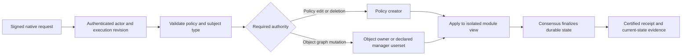

# ACP v1 in Vera

Vera executes ACP in Rust. Policy compilation lives in `crates/acp`, graph
evaluation in `crates/zanzibar`, and authenticated lifecycle operations in
`crates/vera-modules/src/acp`. The native client and optional EVM interface dispatch
to the same module implementation. The Go engine is used only to generate test
fixtures; it is not part of the node or its runtime dependencies.

## Engine surface

The reference is Go `acp_core` v0.8.2, used by Go Vera at
`205df1adcd27a350168b14fe49b9160387acba93`.

| Go engine operation | Rust module entry point |
| --- | --- |
| CreatePolicy / CreatePolicyWithSpecification | `execute_create_policy(PolicyCreation)`; YAML and JSON definitions |
| EditPolicy | `edit_policy_at`; keeps the policy ID, specification and existing resources |
| EditPolicyMetadata | `edit_policy_metadata`; replaces supplied attributes/blob |
| GetPolicy / ListPolicies | `query_policy`, `query_policies`, `query_policies_page` |
| ValidatePolicy | `query_validate_policy`, `validate_policy_definition` |
| DeletePolicy | `delete_policy`; policy creator authorization and dependent-record cleanup |
| SetRelationship / DeleteRelationship | `execute_policy_cmd`; typed actor, wildcard, object and userset subjects |
| FilterRelationships | `query_filter_relationships`, `query_relationships_page` with structured selectors |
| RegisterObject / ArchiveObject / UnarchiveObject | `execute_policy_cmd` |
| TransferObject | `transfer_object` or `PolicyCmd::TransferObject` |
| GetObjectRegistration | `query_object_registration`; includes archived ownership |
| VerifyAccessRequest | `query_verify_access_request`; union, intersection, exclusion and traversal |
| CheckManagementAuthority | `check_management_authority`; evaluates owner and declared manager relations |
| GetPolicyCatalogue | `query_policy_catalogue`; declared names, known live objects and actors |
| EvaluateTheorem | `evaluate_theorem`; authorization and delegation assertions |
| AmendRegistration / RevealRegistration | authenticated commitment/reveal workflow; callers cannot choose a privileged principal or arbitrary earlier timestamp |
| SetParams / GetParams | Go core parameters are empty. Vera's operational parameters use the existing operator-authorized configuration |
| GetRuntimeManager | host plumbing, replaced by execution context and the module store |

Native calls are declared in `acp/abi.rs`. `VeraClient` exposes typed methods in
`native_tx/acp_lifecycle.rs` and `query/acp_lifecycle.rs`. `executePolicyCommand`
accepts a `PolicyCommandRequest` containing the command and optional supplied
metadata. Supplied metadata is supported when registering an object, creating a
grant, or revealing a registration. A repeated grant returns its original metadata.

## Authority and ordering

Creating a policy does not grant management rights over objects registered by
other actors. Managers can be recursive usersets, so revoking their group membership
revokes management authority. Ownership cannot be added or deleted with ordinary
relationship commands. Transfer changes the owner while preserving registration
priority and other grants. Archive removes grants and retains the archived owner;
unarchive restores ownership without restoring deleted grants.

Definition edits prune both removed relations and grants whose usersets refer to
removed relations. Recreating a relation cannot resurrect those deleted edges.
Policy deletion removes its relationships, pending commitments and amendment
indexes. Historical access decisions and finalized receipts remain audit records.

Native policy creation records the actual actor, signer, submission and execution
revision. Definition/metadata edits record their last-modified revision. Optional
supplied metadata fields preserve the existing JSON encoding when empty. The
Borsh encoding of commitment and amendment metadata is unchanged.

These authorization and pruning changes affect execution results. Validators in
one consensus group must use a compatible release; this is not a rolling upgrade
between different execution rules.

## Deliberate differences and boundaries

This is a feature port, not a claim of identical transport or parser behavior:

- Existing Rust policies may explicitly declare/reference `owner`, omit subject
  `types` to allow unrestricted subjects, and define actor roles managed by the
  policy creator. Go rejects explicit owner syntax and grants to relations with
  no allowed subject types. **Declare `types` explicitly when moving policies from
  Go**; omitting them does not have the same authorization meaning.
- Unknown specification names are rejected. They do not silently become policies
  with no specification. Omitted specification on edit retains the selected one.
- Go's reachability-theorem evaluator returns success without evaluating the
  assertion. Rust rejects nonempty `ImpliedRelations` blocks. Authorization and
  delegation assertions are evaluated, with source byte ranges and individual
  accepted/rejected/error results.
- Read convenience methods report the endpoint's state and carry no finality
  proof. Use the existing certified permission/record/prefix APIs when independent
  verification is required. A theorem report is not a permission grant.
- Definitions and supplied metadata are limited to 64 KiB; theorem sources to
  64 KiB and 64 assertions. Pages inspect at most 128 records / 1 MiB, including
  records rejected by a filter. An empty page can have a continuation cursor.
  Cursors are exclusive storage positions, not revision certificates; repeated
  live RPC calls can observe different revisions. Unpaged queries reject oversized
  results rather than silently truncate. For larger catalogues, enumerate the
  relationship pages and combine them with the policy's declared resources.
- Policy deletion and definition edits scan their dependent records; large-policy
  mutation costs still require workload qualification. This port does not establish
  new throughput numbers or a production load guarantee.

ACP v1 edits use finalized execution order. They do not implement offline policy
branch merging, causal policy pins, or the separate ACP v2 design.

## Validation

`tools/acp-oracle` pins and executes the Go engine to produce the committed
fixtures. `acp_go_parity` replays those operations, checks failed writes leave
state unchanged, and validates restoration after every step. Additional lifecycle,
pagination and native-dispatch tests cover metadata, ownership, revocation,
corruption, bounds, gas rejection and batch rollback. The canonical four-member
integration test exercises the new native client calls and verifies their finality
receipts. CI runs the fixture replay without requiring Go.
